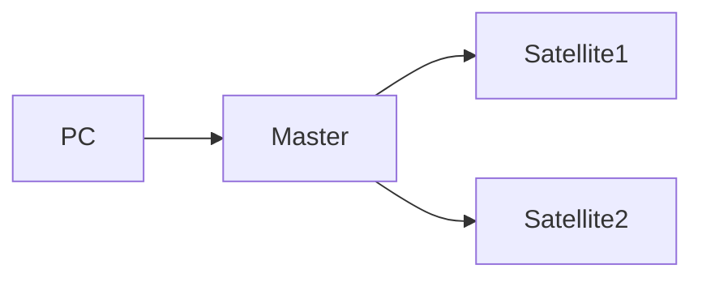

# 250822 ARTIQ测试报告

<b>Author: Haopeng Wang</b>

<b>Date: 250822</b>

## 一 、ARTIQ简介

​	ARTIQ是一款专为量子物理实验设计的控制系统，最早由NIST的Ion Storage Group发起，现由M-Labs维护与开发。ARTIQ支持使用高级编程语言Python，并且与其专用硬件Sinara搭配可以实现纳秒级的分辨率以及亚微秒级的延迟。

​	ARTIQ的架构如下图所示。PC将编写好的程序发送给Master Controller，然后Master Controller控制其下对应的Eurocard Extension Module(EEM)在设定时间执行事件，如果程序中使用了Satellite Crate中的EEM，Master Controller会先通过Distributed Real-Time I/O(DRTIO)链路，将事件发送给对应Satellite Crate中的Satellite Controller，然后Satellite Controller控制其下对应的EEM在设定时间执行事件。

图1.1 ARTIQ架构图

​	在只使用Master上的EEM时，为了保证EEM执行事件的时序能够精确符合程序定义的时序，在将编写好的程序发送给Master Controller后，Master Controller会根据程序计算出每个事件的时间戳（下图中的Software Counter）——即该事件应该在何时被执行，然后CPU会将事件数据与时间戳提交给Gateware前的缓冲区——FIFO。同时机箱内部存在着一个高分辨率的时钟RTIO Counter（下图中的Hardware Counter）用于提供一个绝对的时间参考，当RTIO Counter到达事件的时间戳时，Gateware允许事件执行，事件数据从FIFO离开，驱动对应的物理设备输出信号。

图1.2 时序原理图

​	使用DRTIO时，为了保证Satellite上EEM执行事件的时序也能精确符合程序定义的时序，需要Satellite与Master有同一个绝对的时间参考，具体方式为Master会通过光纤，将此时的RTIO Counter发送给Satellite。当Satellite的FIFO中事件的时间戳与发送来的RTIO Counter一致时，Satellite的Gateware将会允许事件离开，驱动Satellite上对应的物理设备执行事件。**需要注意的是，RTIO Counter的传输需要时间，因此Satellite中的RTIO Counter相比Master会有一个延迟，导致Satellite上事件的执行存在延迟，一般该延迟为固定值，测量后在程序中进行延迟补偿即可消除。**

## 二、测试环境

**Matser Crate ：**

| Item | Description                                                  |
| ---- | ------------------------------------------------------------ |
| 1    | Chassis and assembly (rack)                                  |
| 2    | Sinara 1106 EEM AC Power  Module                             |
| 3    | Sinara 1124 Processor  “Kasli” 2.0                           |
| 4    | Sinara 2128 SMA TTL card                                     |
| 5    | Sinara 2128 SMA TTL card                                     |
| 6    | Sinara 2128 SMA TTL card                                     |
| 7    | Sinara 2128 SMA TTL card                                     |
| 8    | Sinara 2128 SMA TTL card                                     |
| 9    | Sinara 2128 SMA TTL card                                     |
| 10   | Sinara 5632 DAC “Fastino”                                    |
| 11   | Sinara 5528 SMA-IDC adapter                                  |
| 12   | Sinara 5528 SMA-IDC adapter                                  |
| 13   | Sinara 5528 SMA-IDC adapter                                  |
| 14   | Sinara 5528 SMA-IDC adapter                                  |
| 15   | Sinara 4457 synthesizer  “Mirny” with HF mezzanine “Almazny” |
| 16   | Sinara 4624 AWG “Phaser”  (Baseband)                         |
| 17   | Fan Tray                                                     |

**Satellite Crate 1：**

| Item | Description                        |
| ---- | ---------------------------------- |
| 1    | Chassis and assembly (rack)        |
| 2    | Sinara 1106 EEM AC Power  Module   |
| 3    | Sinara 1124 Processor  “Kasli” 2.0 |
| 4    | Sinara 2128 SMA TTL card           |
| 5    | Sinara 2128 SMA TTL card           |
| 6    | Sinara 2128 SMA TTL card           |
| 7    | Sinara 2128 SMA TTL card           |
| 8    | Sinara 2128 SMA TTL card           |
| 9    | Sinara 2128 SMA TTL card           |
| 10   | Sinara 2128 SMA TTL card           |
| 11   | Sinara 2128 SMA TTL card           |
| 12   | Sinara 2128 SMA TTL card           |
| 13   | Sinara 2128 SMA TTL card           |
| 14   | Fan Tray                           |

**Satellite Crate 2：**

| Item | Description                        |
| ---- | ---------------------------------- |
| 1    | Chassis and assembly (rack)        |
| 2    | Sinara 1106 EEM AC Power  Module   |
| 3    | Sinara 1124 Processor  “Kasli” 2.0 |
| 4    | Sinara 5108 Sampler                |
| 5    | Sinara 4410 DDS “Urukul”  (AD9910) |
| 6    | Sinara 4410 DDS “Urukul”  (AD9910) |
| 7    | Sinara 4410 DDS “Urukul”  (AD9910) |
| 8    | Sinara 4410 DDS “Urukul”  (AD9910) |
| 9    | Fan Tray                           |

两个Satellite和Master以星型拓扑连接，Master为中央节点，此外还有一台运行Linux系统的PC与Master通讯。

图1.3 网络拓扑图

## 三、ARTIQ测试数据

## 1、系统

​	**DRTIO延迟：**编写程序，让Master中的TTL与Satellite 1中的TTL同时输出，粉色波形为Satellite 1中的TTL，蓝色波形为Master中的TTL，测得使用DRTIO，Satellite上的RTIO Counter存在~294ns的延迟。

图2.1.1 DRTIO延迟

### 2、TTL（数字信号）

​	关于脉冲参数的定义，详见下面两图。

图2.2.1(a) 脉冲参数示意图

图2.2.1(b) 脉冲参数示意图

​	**最小可输出延时：**TTL最小可设输出延时为3ns，更小则TTL不会输出。当延时设为3ns时，测得输出的脉宽不为3ns，而是4ns。考虑到ARTIQ的coarse RTIO clock机制，最好设置输出延时为8ns以上，以防止意外的错误。

图2.2.2 设置3ns输出延时的TTL信号

图2.2.3 设置8ns输出延时的TTL信号

​	**稳定状态：**设置持续时间1us，占空比为50%的TTL脉冲。测得高电平(Top)约为3.8V，低电平(Base)约为120mV。

图2.2.4 稳定状态的TTL信号

​	**上升沿：**在上升沿的上升时间(Rise Time)约为5.6ns，安定时间约为165ns。

图2.2.5 TTL信号上升沿

​	**下降沿：**在下降沿的下降时间(Fall Time)约为3ns，安定时间约为78ns。

图2.2.6 TTL信号下降沿

​	**同步精度：**编写程序让Master上不同Card的两个TTL通道同时输出，结果如下图，可以发现两个波形的响应时间基本一致，同步精度小于1ns。

图2.2.7 同机箱上TTL信号同步精度

### 3、Fastino（模拟信号）

​	Fastino是一个有32通道、16bit分辨率，输出电平在±10V范围内的DAC。其生成模拟信号的原理为，先依据程序，生成一个对应的具有16bit深度的数字信号，再经DAC将数字信号转换为±10V范围内的模拟信号。

​	**并行输出：**Fastino默认设置log2_width = 0，这使得每个DAC输出通道有单独的RTIO地址，每一个RTIO写操作只能写入一个DAC通道，因此无法做到多个DAC通道同时输出。通过修改固件，可以修改log2_width = $x$，将$2^x$个DAC通道打包到一个RTIO地址中，实现$2^x$个DAC通道同时输出。

​	**输出电平：**输出电平的范围为-10V到10V，但是实际输出会与程序设定值相差±0.2V左右，可能是存在地环路噪声问题，可以短接地线减小噪声。在实际使用时，由于存在偏差，需要根据输出结果调整程序设定值。

​	**响应时间：**编写程序，让Master上一个DAC通道和一个TTL通道同时输出，以电平发生变化的时刻作为响应时刻，测得Fastino的响应时间较TTL延长了~2us。

图2.3.1 模拟信号响应时间

### 4、Mirny（微波射频信号）

​	Mirny是一款基于PLL的微波频率合成器。PLL可以利用低频但稳定的石英晶振与高频但不稳定的VCO，输出稳定且高频的信号。该信号经数字衰减器衰减后，由射频开关控制输出。

图2.4.1 Mirny原理图

​	**输出频率：**标称为53MHz~4GHz，测试最高可以输出6.9GHz，但输出的并不是完美的谐波，当设置输出频率越低时，输出波形越像方波。猜测因为PLL输出的谐波频率恒定，为了让Mirny输出较低或较高频率的信号，需要经过倍频器或分频器，然而倍频器与分频器的输出为方波，为了获得谐波，需要再经过低通滤波器。经过低通滤波器时，较高频率信号的高阶谐波会被滤掉，输出谐波，而较低频率信号则会保留许多高阶项，输出类似方波的波形。

图2.4.2 设置Mirny输出55MHz谐波

图2.4.3 设置Mirny输出100MHz谐波

图2.4.4 设置Mirny输出200MHz谐波

​	**响应时间：**先设置PLL输出频率再打开射频开关，和先打开射频开关再设置PLL输出频率，这两种方式都可以使得Mirny正确输出。对于射频开关，打开开关的响应时间较TTL延长~928us。

图2.4.5 测试Mirny打开射频开关响应时间

​	对于PLL，生成所设频率的响应时间较TTL延长~1.344ms。

图2.4.2 设置Mirny设置输出频率响应时间

​	因此先设置PLL输出频率再打开射频开关可以更快地响应，但两者的响应都较慢。

​	**并行输出：**Minry不能同时配置两个通道的PLL输出频率，但是可以同时打开两个通道的射频开关，所以提前串行设配置多个通道，再同时打开多个通道的射频开关，即可实现多通道并行输出。由于配置PLL后响应时间较长，注意在打开射频开关前为PLL预留充足的延时。

### 5、Phaser（AWG）

​	Phaser是一款AWG，用于产生多音射频信号，其有两个射频输出通道用于输出多音射频信号，同时还有两个模拟输入通道，用于幅度反馈。Phaser有三个Mode，BaseBand Mode，UpConversion Mode与Miqro Mode。在BaseBand Mode中，每个输出通道有五个独立的数控振荡器（NCO）模块，这些NCO模块使用DDS技术产生可控的输出频率。这五个DDS的输出在数字域叠加形成基带信号，经数字上变频器DUC将频率搬移到中频，中频信号经插值滤波器IIR插值后，由DAC进行数模转换、二次插值和补偿，最终输出。

图2.5.1 Phaser原理图

​	如果是UpConversion Mode，则会将DAC的输出信号再送入一个上变频器TRF372017向上变频2.875GHz，将中频信号搬移到射频频域。Miqro Mode则了解不多。我们使用的是BaseBand Mode。

​	**输出频率：**DDS的通带范围为±10MHz，DUC的通带范围为±200MHz，因此通带范围内单音输出可到±210MHz。

​	**幅度限制：**内部DAC为16bit，以机器单位算最大可输入幅度为65535，如果单通道使用了多个振荡器，这些振荡器叠加产生的瞬时波峰可能会超过DAC的输入范围，DAC会进行削波，将输入钳制在可输入范围的最大值上，使得输出信号混入其他谐波。

​	

## 6、Urukul(DDS)

​	Urukul是一款四通道的射频信号生成器，其原理为DDS生成的射频信号，由数字衰减器衰减后，经射频开关输出。Urukul还可以与5018 ADC Sampler协同，形成SU-Servo，用于激光强度稳定等需要反馈的地方。

图2.6.1 Urukul原理图

​	**输出频率：**标称的输出频率为1-400MHz，实际测试能够输出的范围更大一些。

​	**并行输出：**和Mirny一样存在射频开关，因此可以通过同时打开射频开关实现并行输出。

​	**响应时间：**由于Urukul在Satellite上，除去约294ns的DRTIO延时后，测得响应时间约为374-294=80ns。

图2.6.2 测试Urukul响应时间

